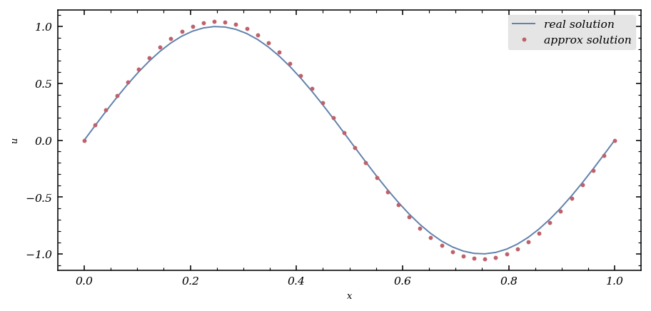
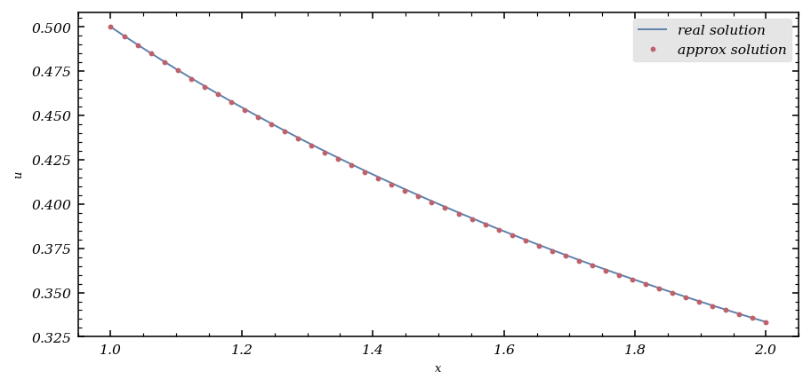
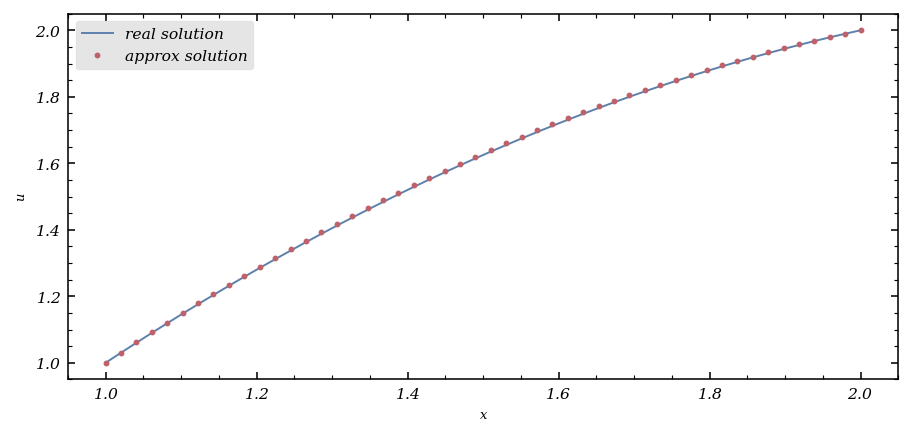
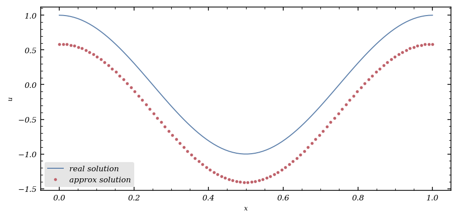
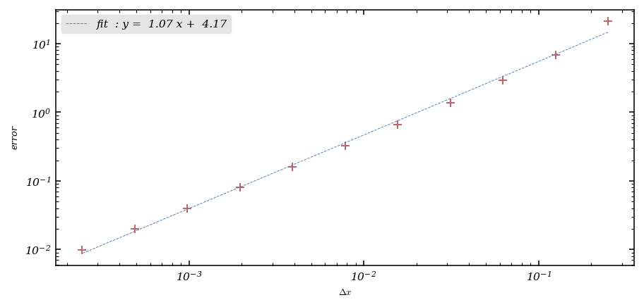
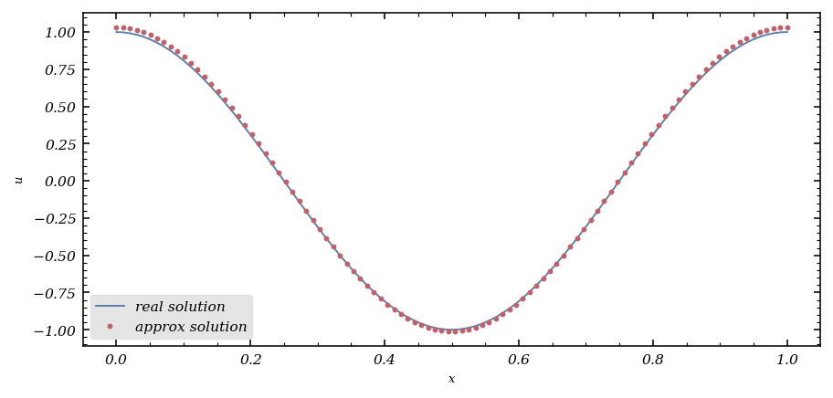
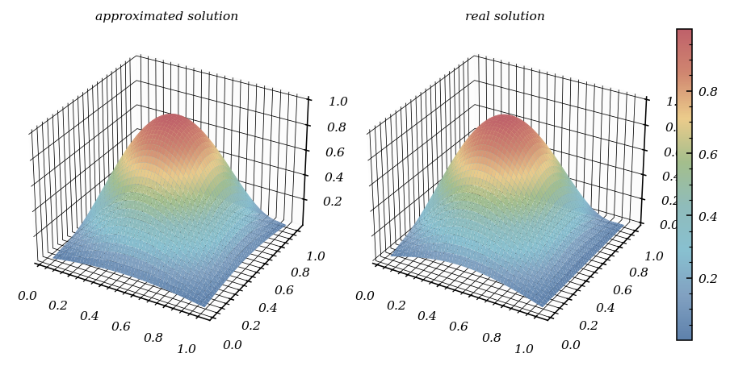

# Finite difference methods for stationary elliptic equations

Second-order linear partial differential equations are classified as either [elliptic](https://en.wikipedia.org/wiki/Elliptic_partial_differential_equation), [hyperbolic](https://en.wikipedia.org/wiki/Hyperbolic_partial_differential_equation), or [parabolic](https://en.wikipedia.org/wiki/Parabolic_partial_differential_equation), with this naming convention inspired by the classification of [conic sections](https://en.wikipedia.org/wiki/Conic_section) or [quadratic forms](https://en.wikipedia.org/wiki/Quadratic_form).

The most fundamental examples of elliptic PDEs are the elegant [Laplace equation](https://en.wikipedia.org/wiki/Laplace_equation) (written here in two dimensions):
$$
-\Delta u(x,y)=-\frac{\partial^2u}{\partial x^2}(x,y)-\frac{\partial^2u}{\partial y^2}(x,y)=0,
$$
and its inhomogeneous counterpart, the [Poisson equation](https://en.wikipedia.org/wiki/Poisson_equation):
$$
-\Delta u(x,y)=-\frac{\partial^2u}{\partial x^2}(x,y)-\frac{\partial^2u}{\partial y^2}(x,y)=f(x,y),
$$
where $f$ is a given source function.

In this article, we'll explore the numerical solution of the Poisson equation using [finite difference methods](https://en.wikipedia.org/wiki/Finite_difference_method) and see how these powerful techniques can be implemented efficiently.

Let's begin by importing the necessary libraries:

```python
import numpy as np

# To draw matplotlib plots within this notebook.
%matplotlib inline
import matplotlib.pyplot as plt
from python_code.nord_cmap import *
import scipy.linalg as linalg
```

## The Poisson equation in 1D with homogeneous Dirichlet boundary conditions

We'll first tackle the numerical solution of the one-dimensional Poisson equation with homogeneous Dirichlet boundary conditions:


$$
\begin{cases}
&-u''(x)=f(x),\ x\in(a,b), \\
&u(a)=0, u(b)=0,
\end{cases}
$$


where $a$ and $b$ are real numbers with $a<b$, and $f$ is a given function of class $\mathscr{C}^2$.

The finite difference approach discretizes this problem by computing values $u_0,\dots,u_N$ (where $N$ is a positive integer) that satisfy:
 
$$
\left\{\begin{align*}
&-\frac{1}{(\Delta x)^2}(u_{j+1}−2\,u_j+u_{j−1})=f(x_j),\  j=1,\dots,N-1,\\
&u_0=u_N=0,
\end{align*}\right.
$$
 

Here, $\Delta x=\frac{b-a}{N}$ is the uniform grid spacing and $x_j=a+j(\Delta x)$ for $j=0,\dots,N$ are the gridpoints. The values $u_0,\dots,u_N$ approximate the exact solution $u(x_0),\dots,u(x_N)$ at these points.

For $N>2$, we can express this system in matrix form:
 
$$
\left\{\begin{align*}
&AU=B,\\
&u_0=u_N=0,
\end{align*}\right.
$$

where
$U=\begin{pmatrix}u_1\\\vdots\\u_{N-1}\end{pmatrix}$,
$B=\begin{pmatrix}f(x_1)\\\vdots\\f(x_{N-1})\end{pmatrix}$ ,
and the matrix $A$ is a tridiagonal matrix of order $N-1$:

$$
A=\frac{1}{(\Delta x)^2}\begin{pmatrix}2&-1&0&\dots&\dots&0\\-1&2&-1&\ddots&&\vdots\\0&\ddots&\ddots&\ddots&\ddots&\vdots\\\vdots&\ddots&\ddots&\ddots&\ddots&0\\\vdots&&\ddots&-1&2&-1\\0&\dots&\dots&0&-1&2\end{pmatrix}
$$


For demonstration, we'll set $a=0$, $b=1$, and $f(x)=(2\pi)^2\sin(2\pi x)$, which gives us the exact solution $u(x)=\sin(2\pi x)$.

Let's implement a function to compute the matrix $A$:

```python
a = 0
b = 1

def compute_system(N):
    Delta_X = (b - a) / N

    diag_1 = [-1 for k in range(N-1)]
    diag_2 = [2 for k in range(N)]
    diag_3 = [-1 for k in range(N-1)]

    M = np.diag(diag_1, -1) + np.diag(diag_2, 0) + np.diag(diag_3, 1)

    return 1 / Delta_X ** 2 * M

A = compute_system(5)
```

Let's verify our matrix construction:

```python
A
```

    array([[ 50., -25.,   0.,   0.,   0.],
           [-25.,  50., -25.,   0.,   0.],
           [  0., -25.,  50., -25.,   0.],
           [  0.,   0., -25.,  50., -25.],
           [  0.,   0.,   0., -25.,  50.]])

Now we'll solve the linear system using LU decomposition from SciPy's linalg module:

```python
from scipy.linalg import lu_factor, lu_solve

def finite_difference_method(B):
    A = compute_system(len(B))
    lu, piv = lu_factor(A)
    U = lu_solve((lu, piv), B)
    return U
```

With our solver ready, let's compute and plot the solution for $N=50$:

```python
X = np.linspace(0,1,50)
B = np.sin(2 * np.pi * X) * (2 * np.pi) ** 2

U = finite_difference_method(B[1:-1])
U = np.array([0, *U, 0])
```

Now we can visualize how well our numerical solution matches the exact solution:

```python
fig, ax = plt.subplots()
color = color_list(2)

ax.plot(X, np.sin(2 * np.pi * X), color = color[0], lw = 1, label = 'real solution')
ax.plot(X, U,  'o', lw = 1,color = color[1], label = 'approx solution', markersize = 2)
ax.legend()

ax.set_xlabel('x')
ax.set_ylabel('u')
```



## The Poisson equation in 1D with non-homogeneous Dirichlet boundary conditions

Next, let's consider the Poisson equation with non-homogeneous Dirichlet boundary conditions:
 
$$
\left\{\begin{align*}
&-u''(x)=f(x),\ x\in(a,b),\\
&u(a)=\alpha,\ u(b)=\beta,
\end{align*}\right.
$$

where $\alpha$ and $\beta$ are non-zero constants.

When dealing with non-homogeneous boundary conditions, we need to modify our linear system. The boundary values now appear on the right-hand side of the equations for the first and last interior grid points.

Let's solve this specific problem:
 
$$
\left\{\begin{align*}
&-u''(x)=-\frac{2}{(1+x)^3},\ x\in(1,2),\\
&u(1)=\frac{1}{2},\ u(2)=\frac{1}{3},
\end{align*}\right.
$$
 
which has the exact solution $u(x)=\frac{1}{1+x}$.

```python
X = np.linspace(1,2,50)
B = - 2 / (1 + X) ** 3

B[1] += 1/2 * 48 ** 2
B[-2] += 1/3 * 48 ** 2

U = finite_difference_method(B[1:-1])
U = np.array([1/2, *U, 1/3])

fig, ax = plt.subplots()
color = color_list(2)

ax.plot(X, 1 / (1 + X), color = color[0], lw = 1, label = 'real solution')
ax.plot(X, U, 'o', lw = 1, color = color[1], label = 'approx solution', markersize = 2)
ax.legend()

ax.set_xlabel('x')
ax.set_ylabel('u')
```




Now let's solve another problem with non-homogeneous boundary conditions:
 
$$
\left\{\begin{align*}
&-u''(x)=1,\ x\in(1,2),\\
&u(1)=1,\ u(2)=2.
\end{align*}\right.
$$
 

The analytical solution to this problem is $u(x) = -\frac{1}{2}x^2 + \frac{5}{2}x - 1$.

```python
X = np.linspace(1,2,50)
B = np.ones(shape = 50)

B[1] += 1 * 48 ** 2
B[-2] += 2 * 48 ** 2

U = finite_difference_method(B[1:-1])
U = np.array([1, *U, 2])

fig, ax = plt.subplots()
color = color_list(2)

ax.plot(X, - 1/2 * X **2 + 5/2 * X - 1, color = color[0], lw = 1, label = 'real solution')
ax.plot(X, U, 'o', lw = 1, color = color[1], label = 'approx solution', markersize = 2)
ax.legend()

ax.set_xlabel('x')
ax.set_ylabel('u')
```



## The Poisson equation in 1D with homogeneous Neumann boundary conditions

Finally, let's examine the Poisson equation with homogeneous Neumann boundary conditions:
 
$$
\left\{\begin{align*}
&-u''(x)+u(x)=f(x),\ x\in(a,b),\\
&u'(a)=0,\ u'(b)=0,
\end{align*}\right.
$$
 

To handle these conditions, we can use forward and backward finite differences at the boundaries:
 
$$
u'(a)\simeq\frac{u(a+\Delta x)−u(a)}{\Delta x},\ u'(b)\simeq\frac{u(b)−u(b-\Delta x)}{\Delta x},
$$
 

This leads to the following scheme:
 
$$
\left\{\begin{align*}
&\frac{1}{\Delta x^2}(u_{j-1}-2\,u_j+u_{j+1})+u_j=f(x_j),\ j=1,\dots,N-1,\\
&\frac{u_1−u_0}{\Delta x}=0,\ \frac{u_N−u_{N-1}}{\Delta x}=0.
\end{align*}\right.
$$
 

We can express this as a matrix system:
 
$$
\left\{\begin{align*}
&(\tilde{A}+I_{N-1})U=B\\
&u_0=u_1,\ u_N=u_{N-1},
\end{align*}\right.
$$
 

where $\tilde{A}$ is the modified matrix:
 
$$\tilde{A}=\frac{1}{(\Delta x)^2}\begin{pmatrix}1&-1&0&\dots&\dots&0\\-1&2&-1&\ddots&&\vdots\\0&\ddots&\ddots&\ddots&\ddots&\vdots\\\vdots&\ddots&\ddots&\ddots&\ddots&0\\\vdots&&\ddots&-1&2&-1\\0&\dots&\dots&0&-1&1\end{pmatrix}
$$
 

Let's implement this:

```python
a = 0 ; b = 1

def compute_Neumann(N):
    Delta_X = (b - a) / N

    diag_1 = [-1 for k in range(N - 1)]
    diag_2 = [2 for k in range(N)]
    diag_3 = [-1 for k in range(N - 1)]

    M = np.diag(diag_1, -1) + np.diag(diag_2, 0) + np.diag(diag_3, 1)

    M[0,0] = 1
    M[-1,-1] = 1
    return 1 / Delta_X ** 2 * M

def finite_difference_neumann(B):
    A = compute_Neumann(len(B)) + np.identity(len(B))
    lu, piv = lu_factor(A)
    U = lu_solve((lu, piv), B)
    return U
```

For this example, we set $f(x)=((2\pi)^2+1)\cos(2\pi x)$, which gives the solution $u(x)=\cos(2\pi x)$.

```python
X = np.linspace(0,1,100)
B = ((2*np.pi) ** 2 + 1) * np.cos(2 * np.pi * X)

U = finite_difference_neumann(B[1:-1])
U = np.array([U[0], *U, U[-1]])

fig, ax = plt.subplots()
color = color_list(2)

ax.plot(X, np.cos(2 * np.pi * X), color = color[0], lw = 1, label = 'real solution')
ax.plot(X, U, 'o', lw = 1, color = color[1], label = 'approx solution', markersize = 2)
ax.legend()

ax.set_xlabel('x')
ax.set_ylabel('u')
```



Let's verify the convergence rate:

```python
N = np.array([2**k for k in range(2,13)])
error = []
for num in N:
    X = np.linspace(0,1,num)
    B = ((2*np.pi) ** 2 + 1) * np.cos(2 * np.pi * X)

    U = finite_difference_neumann(B[1:-1])
    U = np.array([U[0], *U, U[-1]])

    error.append(np.max(np.abs(U - np.cos(2 * np.pi * X))))

fig, ax = plt.subplots()
Delta_X = 1 / N
ax.loglog(Delta_X, error, 'o', color = color[-1], marker = '+')

fit = np.polyfit(np.log(Delta_X), np.log(error), 1)

ax.plot(Delta_X, np.exp(fit[1])*((Delta_X) ** (fit[0])), '--',
        color = color[0], label = f'fit: y = {fit[0] : .2f} x + {fit[1]: .2f}', lw = .5)
ax.set_xlabel('$\Delta x$')
ax.set_ylabel('error')
ax.legend()
```



The first-order approximation of the boundary conditions limits the overall convergence rate. To achieve second-order convergence, we need a more accurate approximation at the boundaries.

### Second-order approximation of the Neumann boundary conditions

Using Taylor expansion, we can derive a second-order approximation for the Neumann boundary conditions:

$$
u'(a)=\frac{1}{\Delta x}\left(u(a+\Delta x)−u(a)-\frac{(\Delta x)^2}{2}u''(a)\right)+O((\Delta x)^2)=\frac{1}{\Delta x}(u(a+\Delta x)−u(a))+\frac{\Delta x}{2}(f(a)−u(a))+O((\Delta x)^2),
$$

This leads to an improved scheme:

```python
def compute_second_order_Neumann(N):
    Delta_X = (b - a) / N

    diag_1 = [-1 for k in range(N - 1)]
    diag_2 = [2 for k in range(N)]
    diag_3 = [-1 for k in range(N - 1)]

    M = np.diag(diag_1, -1) + np.diag(diag_2, 0) + np.diag(diag_3, 1)

    factor = 1/Delta_X / (1 / Delta_X + Delta_X / 2)
    M[0,0] = 2 - factor
    M[-1,-1] = 2 - factor
    return 1 / Delta_X ** 2 * M

def finite_difference_neumann(B):
    A = compute_second_order_Neumann(len(B)) + np.identity(len(B))
    lu, piv = lu_factor(A)
    U = lu_solve((lu, piv), B)
    return U
```

Let's apply this improved method:

```python
X = np.linspace(0,1,100)
Delta_X = (b - a) / 100
factor = 1 / Delta_X + Delta_X / 2
B = ((2*np.pi) ** 2 + 1) * np.cos(2 * np.pi * X)

B[1] += (1 / (2 * Delta_X) ) / factor * B[0]
B[-2] += (1 / (2 * Delta_X) ) / factor * B[-1]

U = finite_difference_neumann(B[1:-1])
U = np.array([U[0], *U, U[-1])

fig, ax = plt.subplots()
color = color_list(2)

ax.plot(X, np.cos(2 * np.pi * X), color = color[0], lw = 1, label = 'real solution')
ax.plot(X, U, 'o', lw = 1, color = color[1], label = 'approx solution', markersize = 2)
ax.legend()

ax.set_xlabel('x')
ax.set_ylabel('u')
```




With the second-order approximation of the boundary conditions, we now achieve the expected second-order convergence for the entire method.

## The Poisson equation in 2D

Let's extend our approach to the two-dimensional Poisson equation with homogeneous Dirichlet boundary conditions on a square domain:

$$
\left\{\begin{align*}
&-\Delta u=f\text{ in }\Omega,\\
&u=0\text{ on }\partial\Omega,
\end{align*}\right.
$$

where $\Omega=(a,b)\times(a,b)\subset\mathbb{R}^2$ and $f:\Omega\to\mathbb{R}$ is a given function of class $\mathscr{C}^2$.

We discretize the domain with uniform spacing $h=\Delta x=\Delta y=\frac{b−a}{N}$ and approximate the Laplacian with the five-point stencil:

$$
\Delta u(x_i,y_j)\simeq\frac{1}{h^2}\left(u(x_{i+1},y_j)+u(x_{i−1},y_j)+u(x_i,y_{j+1})+u(x_i,y_{j−1})-4u(x_i,y_j)\right)
$$

for the interior points $i,j=1,\dots,N-1$.

The resulting linear system can be expressed in matrix form as $AU=B$, where $A$ has a block structure:

 
$$
A=-\frac{1}{h^2}\begin{pmatrix}C&I_{N-1}\\I_{N-1}&C&\ddots\\&\ddots&\ddots&\ddots\\&&\ddots&C&I_{N-1}\\&&&I_{N-1}&C\end{pmatrix}
$$
 

with $I_{N-1}$ being the identity matrix of order $N-1$ and $C$ the tridiagonal matrix:

 
$$
C=\begin{pmatrix}-4&1&0&\dots&\dots&0\\1&-4&-1&\ddots&&\vdots\\0&\ddots&\ddots&\ddots&\ddots&\vdots\\\vdots&\ddots&\ddots&\ddots&\ddots&0\\\vdots&&\ddots&1&-4&1\\0&\dots&\dots&0&1&-4\end{pmatrix},
$$
 

Let's implement this using the Kronecker product for efficient matrix construction:

```python
a = 0 ; b = 1

def compute_Poisson_system(N):
    Delta_X = (b - a) / N
    size = (N-1)**2
    diag_1 = [1 for k in range(N - 2)]
    diag_2 = [-4 for k in range(N-1)]
    diag_3 = [1 for k in range(N - 2)]

    C = np.diag(diag_1, -1) + np.diag(diag_2, 0) + np.diag(diag_3, 1)

    big_diag_1 = np.diag([1 for k in range(N - 2)],-1)
    big_diag_2 = np.diag([1 for k in range(N - 2)],1)

    A = np.kron(np.identity(N-1), C) + np.kron(big_diag_1, np.identity(N-1)) + np.kron(big_diag_2, np.identity(N-1))

    return -1 / Delta_X ** 2 * A

def finite_difference_2D(B):
    A = compute_Poisson_system(len(B)-1)
    lu, piv = lu_factor(A)
    U = lu_solve((lu, piv), B[1:-1, 1:-1].flatten())
    return U
```

For our example, we set $f(x,y)=2\pi^2\sin(\pi x)\sin(\pi y)$, which gives the exact solution $u(x,y)=\sin(\pi x)\sin(\pi y)$.

```python
X,Y = np.linspace(0,1,51), np.linspace(0,1,51)
X,Y = np.meshgrid(X,Y)

B = 2 * np.pi ** 2 * np.sin(np.pi * X) * np.sin(np.pi * Y)
U = finite_difference_2D(B)
U2 = B[:1:-1, :1:-1]/(2 * np.pi ** 2)

fig, ax = plt.subplots(1,2, subplot_kw={"projection": "3d"}, layout = 'constrained')

surf_1 = ax[0].plot_surface(X[:1:-1, :1:-1],Y[:1:-1, :1:-1],U.reshape((49,49)), cmap = cmap1)
surf_2= ax[1].plot_surface(X[:1:-1, :1:-1],Y[:1:-1, :1:-1],U2, cmap = cmap1)
ax[0].set_title('approximated solution')
ax[1].set_title('real solution')

plt.colorbar(surf_2, orientation = 'vertical')
```




The 2D method also achieves second-order convergence, but the computational cost increases significantly with the grid size. For an $N \times N$ grid, the matrix size is $(N-1)^2 \times (N-1)^2$, which grows rapidly with $N$.

The runtime increases approximately cubically with the number of points in each dimension ($N$), which is expected due to the $O(n^3)$ complexity of dense matrix operations where $n = (N-1)^2$.

Fortunately, the matrix $A$ is a banded matrix with only four non-zero diagonals, making it an excellent candidate for sparse matrix representations. Let's implement a sparse version using SciPy's sparse library:

```python
import scipy.sparse as sparse
from scipy.sparse.linalg import splu

def compute_Poisson_system_sparse(N):
    Delta_X = (b - a) / N
    size = (N-1)**2

    diag_1 = [1 for k in range(N - 2)]
    diag_2 = [-4 for k in range(N-1)]
    diag_3 = [1 for k in range(N - 2)]

    C = sparse.diags(diag_1, -1) + sparse.diags(diag_2, 0) + sparse.diags(diag_3, 1)

    big_diag_1 = sparse.diags([1 for k in range(N - 2)],-1)
    big_diag_2 = sparse.diags([1 for k in range(N - 2)],1)

    A = sparse.kron(sparse.identity(N-1), C) + sparse.kron(big_diag_1, sparse.identity(N-1)) + sparse.kron(big_diag_2, sparse.identity(N-1))

    return -1 / Delta_X ** 2 * A

def finite_difference_2D_sparse(B):
    A = compute_Poisson_system(len(B)-1)
    lu = splu(A)
    U = lu.solve(B[1:-1, 1:-1].flatten())
    return U
```

In conclusion, finite difference methods provide powerful tools for solving elliptic PDEs like the Poisson equation. When implemented correctly, they achieve second-order convergence and can be made computationally efficient through sparse matrix techniques. These methods form the foundation for more advanced numerical approaches to PDEs and have wide applications in science and engineering.


