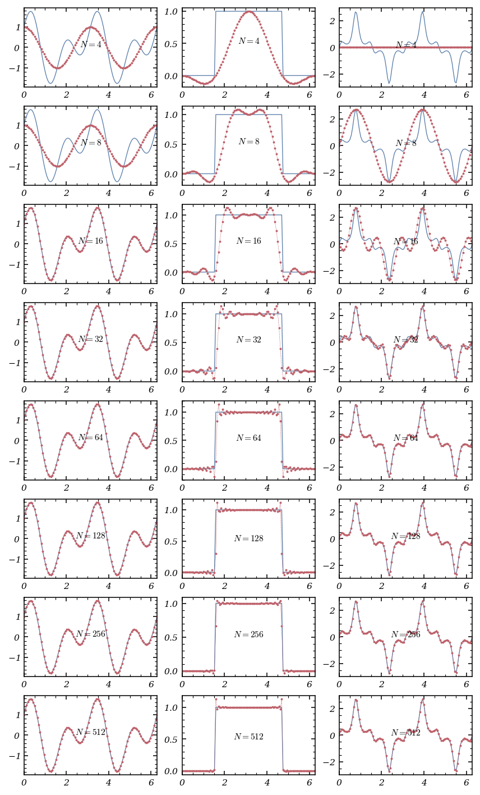
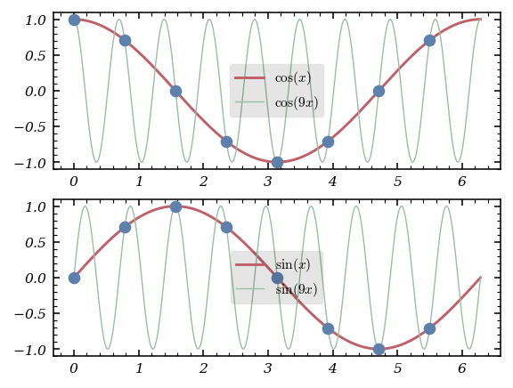
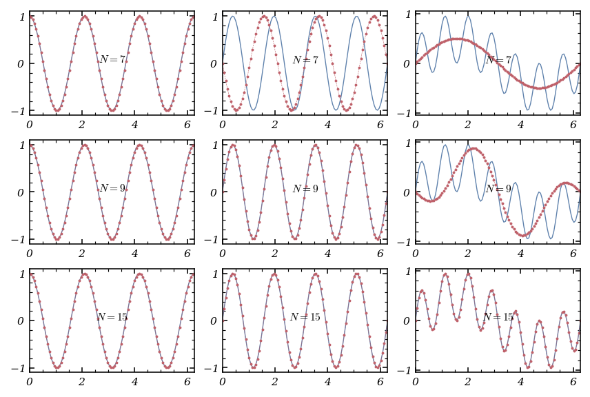
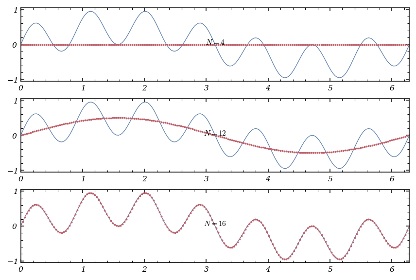

# Tutorial. The Fourier interpolation

Spectral methods are the Ferraris of spatial discretisation for differential equations: fast, elegant, and, when handled with care, incredibly powerful. At their core, these methods approximate the solution $u$ by expanding it in terms of *trial functions*  $\{\phi_k\}_{k=0,\dots,N-1}$:


$$
u(x)\approx\sum_{k=0}^{N-1}\tilde{u}_k\phi_k(x),
$$


where the $N$ coefficients $\tilde{u}_k$ are the keys to unlocking the approximation.

But what makes a good set of trial functions? The answer is a blend of mathematical beauty and computational pragmatism. We want:

* **Convergence:** The approximation should rapidly approach $u$ as $N$ grows.
* **Transformation:** Computing the coefficients $\tilde{u}_k$ from $u$, and reconstructing $u$ from these coefficients, should be lightning fast.
* **Differentiation:** Given the coefficients for $u$, it should be easy to get those for its derivative.

For periodic problems, the Fourier system is the natural choice. The orthogonal set


$$
\forall k\in\mathbb{Z},\ \phi_k(x)=e^{ikx}
$$


over $(0,2\pi)$ is not just mathematically elegant, but also computationally efficient thanks to the [fast Fourier transform](https://en.wikipedia.org/wiki/Fast_Fourier_transform) (FFT). The interpolant of $u$ then takes the form


$$
\sum_{k=-K}^K\tilde{u}_k\phi_k
$$


if $N=2K+1$ is odd, or


$$
\sum_{k=-K+1}^K\tilde{u}_k\phi_k
$$


if $N=2K$ is even. Here, the $\tilde{u}_k$ are the *discrete Fourier coefficients* of $u$.

---

## Fast Fourier Transform: The Engine Under the Hood

Let’s get our hands dirty. Suppose we have an even integer $N$ and $N$ equispaced points in $[0,2\pi]$:


$$
x_j=\frac{2\pi j}{N},\ j=0,\dots,N-1.
$$


Given a periodic function $u$, its trigonometric interpolant at these nodes is


$$
I_Nu(x)=\frac{1}{N}\sum_{k=-N/2+1}^{N/2}\tilde{u}_k\,e^{ikx},
$$


with coefficients


$$
\tilde{u}_k=\sum_{j=0}^{N-1}u(x_j)\,e^{-ikx_j},\ k=-\frac{N}{2}+1,\dots,\frac{N}{2}.
$$


The FFT algorithm, available in `numpy`, computes these coefficients in $O(N\log_2(N))$ time—a dramatic speedup over the naive approach.

Let’s see this in action:

```python
import numpy as np

# To draw matplotlib plots within this notebook.
%matplotlib inline
import matplotlib.pyplot as plt
from python_code.nord_cmap import *
from tqdm import tqdm
from typing import Iterable, Callable

def fft(u : Callable, N : int) -> Iterable :
    """fft compute expansion coefficients of the interpolant of u"""
    X = np.arange(0, N) * np.pi * 2 / N
    U = u(X).astype(complex)

    def Cooley_tukey(x) :
        N = len(x)
        if N == 1:
            return x
        else:
            X_even = Cooley_tukey(x[::2])
            X_odd = Cooley_tukey(x[1::2])
            factor = np.exp(-2j*np.pi*np.arange(N)/ N)
            X = np.concatenate([
                X_even+factor[:int(N/2)]*X_odd,
                X_even+factor[int(N/2):]*X_odd])
            return X

    U = Cooley_tukey(U)
    return U
```

But computing the coefficients is only half the story. To reconstruct the interpolant at arbitrary points, we need:

```python
def interpolant_fft(u : Callable,set_points : Iterable, N : int = 256 ) :
    """
    interpolant_fft compute the fourier interpolant of a function u
    """
    expansion_coeffs = np.fft.fft(u(np.linspace(0,np.pi *2, N,endpoint= False)))
    k = np.concatenate([np.arange(0,N//2 + 1), np.arange(-N//2 + 1, 0)])
    interpolant_approximation = np.empty_like(set_points, dtype= np.complex128)
    for j, x in enumerate(set_points):
        interpolant_approximation[j] = 1/N * np.sum(expansion_coeffs * np.exp(1j * k * x))
    return interpolant_approximation
```

Is the Fourier interpolant of a real function always real? Not necessarily! The interpolant is real at the interpolation nodes if the input function is real, but at arbitrary points, round-off and the nature of the complex exponential can introduce small imaginary parts.

---

## Putting Fourier Interpolation to the Test

Let’s see how this works for some classic functions:

```python
def u1(x) : return np.cos(2 * x) + np.sin(4 * x)
def u2(x) :
    mask =  np.abs(x - np.pi) < np.pi / 2
    a = np.zeros_like(x)
    a[mask] = 1
    return a
def u3(x) : return np.sin(2 * x) * np.exp(np.cos(8 * x))
```

And now, the grand tour—plotting the original functions and their interpolants for various $N$:

```python
fig, ax = plt.subplots(8,3, figsize = (6,10))
Num = [2**k for k in range(2,10)]
x = np.linspace(0,2 * np.pi, 100)
functions = [u1, u2, u3]
color = color_list(2)
for j in range(len(Num)) :
    for k in range(3) :
        ax[j,k].plot(x, functions[k](x), lw = .7, color = color[0])
        ax[j,k].plot(x, interpolant_fft(functions[k],x, N = Num[j]),'--', lw = .3 , marker = '.', markersize = 2,color = color[1])
        ax[j,k].set_xlim(0, 2 * np.pi)
        ax[j,k].text(np.pi, np.mean(functions[k](x)), f"$N = {Num[j]}$", ha = 'center')
```



Notice the [Gibbs phenomenon](https://en.wikipedia.org/wiki/Gibbs_phenomenon) for the discontinuous function $u_2$—the Fourier interpolant overshoots near the jump, a classic spectral quirk.

---

## Differentiation: The Spectral Way

Spectral methods shine when it comes to differentiation. The Fourier interpolation derivative of $u$ is simply the derivative of its interpolant:


$$
\mathcal{D}_Nu=(I_Nu)' = \sum_{k=-N/2+1}^{N/2}{ik\tilde{u}_k e^{ikx}}.
$$


This means we can compute the derivative in spectral space by multiplying each coefficient by $ik$.

```python
def der_interpolant_coeff(u : Callable, N : int = 256) :
    """
    der_interpolant_coeff compute the expansion 's coefficients of u'
    """
    expansion_coeffs = np.fft.fft(u(np.linspace(0,2 * np.pi, N, endpoint= False)))
    k = np.concatenate([np.arange(0,N/2 + 1), np.arange(-N/2 + 1, 0)])
    return 1j * k * expansion_coeffs
```

To get the values at the nodes, we use the inverse FFT:

```python
def der_interpolant(u : Callable, nodes : Iterable, N : int = 256) :
    """
    der_interpolant compute the interpolation of u'
    """
    D_coeff = der_interpolant_coeff(u, N)
    k = np.concatenate([np.arange(0,N/2 + 1), np.arange(-N/2 + 1, 0)])
    interpolation_der = np.empty_like(nodes, dtype= np.complex128)
    for j, x in enumerate(nodes):
        interpolation_der[j] = 1/N * np.sum(D_coeff* np.exp(1j * k * x))
    return interpolation_der
```

Let’s compare the true derivatives and their spectral approximations:

```python
def u_1(x) : return np.cos(x) + np.sin(2 * x)
def u_2(x) :
    mask =  np.abs(x - np.pi) < np.pi / 2
    a = np.zeros_like(x)
    a[mask] = 1
    return a
def u_3(x) : return np.sin(2 * x) * np.exp(np.cos(8 * x))

def u1_p(x) : return -np.sin(x) + 2 * np.cos(2 * x)
def u2_p(x) : return np.zeros_like(x)
def u3_p(x) : return np.exp(np.cos(8 * x)) * (2 * np.cos(2 * x)  - 8 * np.sin(2 * x) * np.sin(8 * x))
```

```python
fig, ax = plt.subplots(8,3, figsize = (6,10))
Num = [2**k for k in range(2,10)]
x = np.linspace(0,2 * np.pi, 500)
functions = [u_1, u_2, u_3]
functions_p = [u1_p, u2_p, u3_p]
color = color_list(2)
for j in range(len(Num)) :
    for k in range(3) :
        ax[j,k].plot(x, functions_p[k](x), lw = .7, color = color[0])
        ax[j,k].plot(x, der_interpolant(functions[k],x, Num[j]) ,'--', lw = .3 , marker = '.', markersize = 2,color = color[1])
        ax[j,k].set_xlim(0, 2 * np.pi)
        ax[j,k].text(np.pi, np.mean(functions_p[k](x)), f"$N = {Num[j]}$", ha = 'center')
```


The spectral derivative is impressively accurate for smooth functions, but struggles with discontinuities—again, the Gibbs phenomenon rears its head.

---

## Aliasing: When High Frequencies Masquerade as Low

Aliasing is the spectral equivalent of a costume party: high-frequency modes can masquerade as lower ones on a discrete grid. For example, $e^{ix}$ and $e^{9ix}$ are indistinguishable on the grid $\{\frac{\pi j}{4},\ j=0,\dots,7\}$.

```python
x=np.linspace(0,2*np.pi,8,endpoint=False)
y=np.linspace(0,2*np.pi,1000)
color = color_list(3)[::-1]
fig,axs=plt.subplots(2,1,figsize=(4,3))
axs[0].plot(y,np.cos(y),label=r'$\cos(x)$', color = color[0])
axs[0].plot(y,np.cos(9*y),lw = .7, label=r'$\cos(9x)$', color = color[1])
axs[0].plot(x,np.cos(x),'o', color = color[2])
axs[0].legend(loc = 'center')

axs[1].plot(y,np.sin(y),label=r'$\sin(x)$', color = color[0])
axs[1].plot(y,np.sin(9*y),lw = .7,label=r'$\sin(9x)$', color = color[1])
axs[1].plot(x,np.sin(x),'o', color = color[2])
axs[1].legend(loc = 'center')
```



Let’s take $u(x)=\cos(3x)$, $v(x)=\sin(4x)$, and $s(x)=u(x)v(x)$. What’s the Fourier series for $s$? The product introduces new frequencies, and unless $N$ is large enough, the interpolant $I_Ns$ won’t capture $s$ exactly.

Let’s plot $u$, $v$, $s$, and their interpolants for $N=7,9,15$:

```python
def u1(x) : return np.cos(3 * x)
def u2(x) : return np.sin(4 * x)
def u3(x) : return u1(x) * u2(x)

fig, ax = plt.subplots(3,3, figsize = (6,4))
Num = [7,9,15]
x = np.linspace(0,2 * np.pi, 100)
functions = [u1, u2, u3]
color = color_list(2)
for j in range(len(Num)) :
    for k in range(3) :
        ax[j,k].plot(x, functions[k](x), lw = .7, color = color[0])
        ax[j,k].plot(x, interpolant_fft(functions[k],x, N = Num[j]),'--', lw = .3 , marker = '.', markersize = 2,color = color[1])
        ax[j,k].set_xlim(0, 2 * np.pi)
        ax[j,k].text(np.pi, np.mean(functions[k](x)), f"$N = {Num[j]}$", ha = 'center')
```



Notice how the interpolant for $s$ only matches the true function when $N$ is large enough to resolve all frequencies.

---

## The Two-Thirds Rule: Orszag’s Antidote to Aliasing

Aliasing is especially problematic in nonlinear computations. When multiplying two functions, new frequencies appear that may not be representable on the grid, leading to errors. The *two-thirds rule*, introduced by Orszag, is a clever fix:

1. **Zero-pad** the spectral coefficients to size $M = \frac{3N}{2}$.
2. **Inverse FFT** to physical space, multiply the functions.
3. **FFT** the product, then **truncate** back to $N$ coefficients, scaling by $\frac{3}{2}$.

Here’s how you can implement it:

```python
def Orsag_method(u : Callable,v : Callable, N : int):
    """
    Orsag_method Compute the fft of u * v using two-thirds rule in order to de-aliased the expansion
    """
    x = np.linspace(0, 2 * np.pi, N, endpoint= False)
    U, V = np.fft.fft(u(x)) , np.fft.fft(v(x))
    M = 3 * N // 2
    # extending arrays of fft cefficients to the size M
    U_, V_ = np.insert(U, N//2, np.zeros(N//2)), np.insert(V, N//2, np.zeros(N//2))
    u_tilde, v_tilde = np.fft.ifft(U_), np.fft.ifft(V_)
    s = np.fft.fft(u_tilde * v_tilde)
    return 3/2 * np.concatenate([s[:N//2], s[N:]])
```

And to visualize the effect:

```python
fig, ax = plt.subplots(3, figsize = (6,4))
Num = [4,12,16]
x = np.linspace(0,2 * np.pi, 200)
color = color_list(2)
for j in range(len(Num)) :
    ax[j].plot(x, u3(x), lw = .7, color = color[0])
    ax[j].plot(x, interpolant_fft(Orsag_method(u1,u2, Num[j]),x,N = Num[j]), '--', lw = .3 , marker = '.', markersize = 2,color = color[1])
    ax[j].set_xlim(0, 2 * np.pi)
    ax[j].text(np.pi, np.mean(u3(x)), f"$N = {Num[j]}$", ha = 'center')
```



The two-thirds rule doesn’t increase resolution, but it does suppress aliasing errors, making your spectral computations more robust.

---

## Conclusion

Fourier interpolation is a powerful tool for periodic problems, offering speed, accuracy, and mathematical elegance. But, as with any high-performance machine, it requires careful handling—especially when dealing with discontinuities or nonlinearities. With the FFT, spectral differentiation, and de-aliasing tricks like the two-thirds rule, you’re well-equipped to harness the full power of spectral methods. Happy computing!


