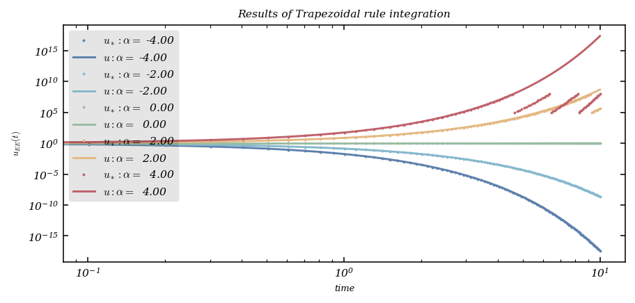

# A Gentle Journey Through Numerical Methods for ODEs

A general technique for solving problems with partial differential equations (PDEs) that involve a time variable $t$ and one or more space variables is the so-called [method of lines](https://en.wikipedia.org/wiki/Method_of_lines). This approach discretizes the spatial derivatives, leaving the time variable continuous, reducing the PDE to a system of ordinary differential equations (ODEs). One then tackles the resulting Cauchy problem for the ODEs using standard numerical methods. Most modern ODE solvers offer convenience and flexibility, especially for one-dimensional spatial problems.

Here, we review widely used methods for basic Cauchy problems:

$$
\begin{cases}
u'(t)=f(t,u(t)),\ t>0,\\
u(0) = u_0,
\end{cases}
$$

where $u$ typically takes values in $\mathbb{R}^d$. Our examples rely on <tt>numpy</tt> and <tt>matplotlib</tt>:

```python
import numpy as np

# To draw matplotlib plots within this notebook.
import matplotlib.pyplot as plt
from python_code.nord_cmap import * # import mycmap
```

Below, we explore the classic SIR model, along with convergence checks and practical concerns such as energy conservation in oscillatory systems and stability in stiff equations. Overarching themes include explicit and implicit methods, Runge–Kutta schemes, and linear multistep techniques.

## Illustrative Example: The SIR Model

The Kermack-McKendrick [SIR model](http://en.wikipedia.org/wiki/Compartmental_models_in_epidemiology#The_SIR_model) describes susceptible, infected, and recovered populations:

$$
\left\{
\begin{align*}
S'(t)&=-r\,S(t)\,I(t),\\
I'(t)&=r\,S(t)I(t)-a\,I(t),\\
R'(t)&=a\,I(t),
\end{align*}
\right.\ t>0,
$$
with initial data $S(0)=S_0,\ I(0)=I_0,\ R(0)=R_0$. Below, we use:
$$
S_0=762,\ I_0=1,\ R_0=0,\ r=0.00218,\ a=0.44036,\ T=14.
$$

**Explicit Euler Method**
```python
def explicit_euler(f, final_time, init_time, init_data, N_steps) :

    # allocation of memory

    integrated_data = np.zeros(shape = (N_steps, len(init_data)))
    integrated_data[0] = init_data
    h = (final_time - init_time) / N_steps

    for i in range(1, N_steps) :

        integrated_data[i] = integrated_data[i-1] + h * f(h*i,integrated_data[i-1])

    return integrated_data
```
```python
r,a=0.00218,0.44036
def f(t,u): return np.array([-r*u[0]*u[1],r*u[0]*u[1]-a*u[1],a*u[1]])
```
```python
u0=np.array([762.,1.,0])

data = explicit_euler(f, 14, 0, u0, 10**5)
parameter_name = ['S', 'I', 'R']
fig, ax = plt.subplots()
color = color_list(3)

time = np.linspace(0,14, 10**5)

for k in range(len(u0)) :

    ax.plot(time, data[:,k], color = color[k], label = parameter_name[k])
    ax.set_xlabel('time')
    ax.set_ylabel('Population')

    ax.set_title('Results of EE integration')
    ax.legend()
```


We verify conservation of the total population:
```python
Sum = np.sum(data, axis = 1)
checking = Sum - Sum[0]
fig, ax = plt.subplots()
ax.plot(checking, color = color[1], lw = .2)

ax.set_xlabel('number iterations')
ax.set_ylabel('$S_n + I_n + R_n$')
```


**Order of Convergence**
```python
N = np.arange(10,10**4, 50)
all_predicted_data =[]
errors = []

for Num_steps in N :

    all_predicted_data.append(explicit_euler(f, 14, 0, u0, Num_steps))
    errors.append(np.linalg.norm(data[-1] - all_predicted_data[-1][-1],2))

tau = 1/N
fig, ax = plt.subplots()
ax.plot(np.log(tau), np.log(errors), 'o', color = color[1], markersize = 3)
fit = np.polyfit(np.log(tau), np.log(errors), deg  = 1)
poly = np.poly1d(fit)
num = np.linspace(10,10**3,10000)
ax.plot(np.log(tau), poly(np.log(tau)), '--', color = color[2], label = f'fit  : y = {fit[0]} x + {fit[1]}')
ax.set_xlabel('power of discretization')
ax.set_ylabel('errors')
ax.legend()
ax.set_title('Order of Convergence')
```


## The Runge-Kutta 4 Method

A popular staple of scientific computing is the classic fourth-order Runge-Kutta:
```python
def rk4(f, final_time, init_time, init_data, N_steps) :

    integrated_data = np.zeros(shape = (N_steps, len(init_data)))
    integrated_data[0] = init_data
    h = (final_time - init_time) / N_steps

    for i in range(1, N_steps) :

        time = i*h

        k1 = f(time, integrated_data[i-1])
        k2 = f(time + h/2, integrated_data[i-1] + h * k1/2)
        k3 = f(time + h/2, integrated_data[i-1] + h * k2/2)
        k4 = f(time + h, integrated_data[i-1] + h * k3)

        coeffs = np.array([1/6 * k1, 1/3 * k2, 1/3 * k3, 1/6 * k4])
        Butcheur_sum = np.sum(coeffs, axis = 0)
        integrated_data[i] = integrated_data[i-1] + h * Butcheur_sum

    return integrated_data
```
```python
data = rk4(f, 14, 0, u0, 10**5)
parameter_name = ['S', 'I', 'R']
fig, ax = plt.subplots()
color = color_list(3)
u0=np.array([762.,1.,0])
time = np.linspace(0,14, 10**5)

for k in range(len(u0)) :

    ax.plot(time, data[:,k], color = color[k], label = parameter_name[k])
    ax.set_xlabel('time')
    ax.set_ylabel('Population')

    ax.set_title('Results of RK4 integration')
    ax.legend()
```


Again, checking order of convergence:
```python
N = np.arange(10,10**4, 10)
all_predicted_data =[]
errors = []

for Num_steps in N :

    all_predicted_data.append(rk4(f, 14, 0, u0, Num_steps))
    errors.append(np.linalg.norm(data[-1] - all_predicted_data[-1][-1],2))

tau = 1/N
fig, ax = plt.subplots()
ax.plot(np.log(tau), np.log(errors), 'o', color = color[1], markersize = 3)
fit = np.polyfit(np.log(tau), np.log(errors), deg  = 1)
poly = np.poly1d(fit)

ax.plot(np.log(tau), poly(np.log(tau)), '--', color = color[2], label = f'fit  : y = {fit[0] : .2f} x + {fit[1]: .2f}')
ax.set_xlabel('power of discretization')
ax.set_ylabel('errors')
ax.legend()
ax.set_title('Order of Convergence')
```


## Stability with the Dahlquist Test Equation

We proceed with the Dahlquist equation $u'(t)=\alpha u(t)$, $u(0)=1$:

**Explicit Euler**
```python
alphas = np.linspace(-4,4,5)
u0=np.array([1.])
fig, ax = plt.subplots()
color = color_list(5)
time = np.linspace(0,T, N)


for k, alpha  in enumerate(alphas) :

    def f(t,u): return alpha*u
    data = explicit_euler(f, T, 0, u0, N)

    ax.loglog(time, data[:,0], 'o', color = color[k], label = rf'$ u_* : \alpha = $ {alpha : .2f}', markersize = 1)
    ax.loglog(time, np.exp(alpha*time), '-', color = color[k], label = rf'$u : \alpha = $ {alpha: .2f}')
    ax.set_xlabel('time')
    ax.set_ylabel('$u_{EE}(t)$')

    ax.set_title('Results of EE integration')
    ax.legend()
```


For large negative $\alpha$, explicit Euler struggles with stability.

**Implicit Euler**
```python
from scipy.optimize import fsolve

def implicit_EE(f, final_time, init_time, init_data, N_steps) :

    integrated_data = np.zeros(shape = (N_steps, len(init_data)))
    integrated_data[0] = init_data
    h = (final_time - init_time) / N_steps

    for i in range(1,N_steps) :

        def equation(x) : return integrated_data[i-1] - x + h * f (h*i, x)

        integrated_data[i] = fsolve(equation, init_data)

    return integrated_data
```
```python
alphas = np.linspace(-4,4,5)
u0=np.array([1.])
fig, ax = plt.subplots()
color = color_list(5)
time = np.linspace(0,T, N)


for k, alpha  in enumerate(alphas) :

    def f(t,u): return alpha*u
    data = implicit_EE(f, T, 0, u0, N)

    ax.loglog(time, data[:,0], 'o', color = color[k], label = rf'$ u_* : \alpha = $ {alpha : .2f}', markersize = 1)
    ax.loglog(time, np.exp(alpha*time), '-', color = color[k], label = rf'$u : \alpha = $ {alpha: .2f}')
    ax.set_xlabel('time')
    ax.set_ylabel('$u_{EE}(t)$')

    ax.set_title('Results of IE integration')
    ax.legend()
```


**Trapezoidal Rule**
```python
def trapezoidal_rule(f, final_time, init_time, init_data, N_steps) :

    integrated_data = np.zeros(shape = (N_steps, len(init_data)))
    integrated_data[0] = init_data
    h = (final_time - init_time) / N_steps

    for i in range(1,N_steps) :

        def equation(x) : return integrated_data[i-1] + h/2 * f (h*(i-1), integrated_data[i-1]) - x + h/2 * f (h*i, x)

        integrated_data[i] = fsolve(equation, init_data)

    return integrated_data
```
```python
alphas = np.linspace(-4,4,5)
u0=np.array([1.])
fig, ax = plt.subplots()
color = color_list(5)
time = np.linspace(0,T, N)


for k, alpha  in enumerate(alphas) :

    def f(t,u): return alpha*u
    data = trapezoidal_rule(f, T, 0, u0, N)

    ax.loglog(time, data[:,0], 'o', color = color[k], label = rf'$ u_* : \alpha = $ {alpha : .2f}', markersize = 1)
    ax.loglog(time, np.exp(alpha*time), '-', color = color[k], label = rf'$u : \alpha = $ {alpha: .2f}')
    ax.set_xlabel('time')
    ax.set_ylabel('$u_{EE}(t)$')

    ax.set_title('Results of Trapezoidal rule integration')
    ax.legend()
```


## A Second-Order Differential Equation: The Harmonic Oscillator

We examine $u''(t)+\omega^2u(t)=0$ with $u(0)=1$ and $u'(0)=0$. By letting $v=\tfrac{u'}{\omega}$, we also interpret it via a complex exponential system.

```python
omega=1.
alpha=omega*np.array([[0.,-1.],[1.,0.]])

def f(t,y): return alpha.dot(y)

T=20.
N=500

u0=np.array([1.,0.])
```

We compare explicit Euler, implicit Euler, and the trapezoidal rule:
```python
data_1 = explicit_euler(f, 10, 0, u0, 10**2)
data_2 = implicit_EE(f, 10, 0, u0, 10**2)
data_3 = trapezoidal_rule(f, 10, 0, u0, 10**2)

fig, ax = plt.subplots()
color = color_list(3)

time = np.linspace(0,10, 10**2)

ax.plot(data_1[:,0], data_1[:,1], color = color[0], label = 'EE', lw = 2)
ax.plot(data_2[:,0], data_2[:,1], color = color[1], label = 'IE', lw = 2)
ax.plot(data_3[:,0], data_3[:,1], color = color[2], label = 'Trap', lw = 2)

ax.set_xlabel('u')
ax.set_ylabel('v')

ax.set_title('Approximated solutions ')
ax.legend()
```


Trapezoidal rule conserves energy, visible as a closed orbit in the phase portrait.

## Stiff Equations and Absolute Stability

Consider:
$$
\begin{cases}
u'(t)=-50\,\left(u(t)-\sin(t)\right)+\cos(t),\ t>0,\\
u(0)=1.
\end{cases}
$$
**Explicit Euler** with different step sizes:
```python
def f(t,u): return -50*(u-np.sin(t))+np.cos(t)

u0=np.array([1.])

time_1 = np.linspace(0,2, 40)
data_1 = explicit_euler(f, 2, 0, u0, 40)

time_2 = np.linspace(0,2, 80)
data_2 = explicit_euler(f, 2, 0, u0, 80)

time_3 = np.linspace(0,2, 120)
data_3 = explicit_euler(f, 2, 0, u0, 120)

fig, ax = plt.subplots()
color = color_list(3)


ax.loglog(time_1, data_1[:,0], color = color[0], label = f'$h =  0.05$', lw = 2)
ax.loglog(time_2, data_2[:,0], color = color[1], label = f'$h = 0.025$', lw = 2)
ax.loglog(time_3, data_3[:,0], color = color[2], label = f'$h = 0.016$', lw = 2)

ax.set_xlabel('time')
ax.set_ylabel('$u_{EE}$')

ax.set_title('Approximated solutions ')
ax.legend()
```


When the step size is too large, instability arises—typical of a stiff problem. The implicit Euler method remains stable for larger steps:
```python
def f(t,u): return -50*(u-np.sin(t))+np.cos(t)

u0=np.array([1.])

time_1 = np.linspace(0,2, 40)
data_1 = implicit_EE(f, 2, 0, u0, 40)

time_2 = np.linspace(0,2, 80)
data_2 = implicit_EE(f, 2, 0, u0, 80)

time_3 = np.linspace(0,2, 120)
data_3 = implicit_EE(f, 2, 0, u0, 120)

fig, ax = plt.subplots()
color = color_list(3)


ax.loglog(time_1, data_1[:,0], color = color[0], label = f'$h =  0.05$', lw = 2)
ax.loglog(time_2, data_2[:,0], color = color[1], label = f'$h = 0.025$', lw = 2)
ax.loglog(time_3, data_3[:,0], color = color[2], label = f'$h = 0.016$', lw = 2)

ax.set_xlabel('time')
ax.set_ylabel('$u_{EE}$')

ax.set_title('Approximated solutions ')
ax.legend()
```


## A Chaotic Dynamical System: The Lorenz System

We explore the Lorenz equations:

$$
\begin{cases}
x'(t)= \sigma(y(t) - x(t)),\\
y'(t)= x(t)(\rho - z(t)) - y(t),\\
z'(t)= x(t)y(t) - \beta z(t),
\end{cases}
$$

with $\rho=28$, $\sigma=10$, $\beta=8/3$.

```python
rho = 28.
sigma = 10.
b = 8./3.
```
```python
def lorentz_equation(time, data) :

    x = data[0]
    y = data[1]
    z = data[2]

    dx = sigma * (y - x)
    dy = x * (rho - z) - y
    dz = x * y - b * z

    return np.array([dx, dy, dz])
```

We want to numerically solve the resulting system using a two-stage [Runge--Kutta method](https://en.wikipedia.org/wiki/Runge–Kutta_methods), with Butcher's tableau

$$
\begin{array}{c|cc}
0&&\\
1&1&\\
\hline
&\frac{1}{2}&\frac{1}{2}
\end{array},
$$

called [Heun's method](https://en.wikipedia.org/wiki/Heun%27s_method).

**Show theoretically that Heun's method is a second-order method.**

With Heun's method we have :

$\tilde{y}_{i+1} = y_i + h f(t_i,y_i)$

$y_{i+1} = y_i + \frac{h}{2}[f(t_i, y_i) + f(t_{i+1},\tilde{y}_{i+1})]$

if we develop the truncated error expression near $y_{i}^{true}$ we found that the truncation error scales like :
$h^2 $ (linear terms being eliminated by the difference)

**Write an independent function named `rk2` implementing Heun's method.**

```python
def rk2(f, final_time, init_time, init_data, N_steps) :

    integrated_data = np.zeros(shape = (N_steps, len(init_data)))
    integrated_data[0] = init_data
    h = (final_time - init_time) / N_steps

    for i in range(1, N_steps) :

        time = i*h

        k1 = f(time, integrated_data[i-1])
        k2 = f(time + h, integrated_data[i-1] + h * k1)


        coeffs = np.array([1/2 * k1, 1/2* k2])
        Butcheur_sum = np.sum(coeffs, axis = 0)
        integrated_data[i] = integrated_data[i-1] + h * Butcheur_sum

    return integrated_data
```
```python
u0=np.array([1.,1.,1])

data = rk2(lorentz_equation, 100, 0, u0, 10**5)
parameter_name = ['x', 'y', 'z']
color = color_list(3)
```
```python
fig, ax = plt.subplots(subplot_kw={"projection": "3d"})

x = data[:,0]
y = data[:,1]
z = data[:,2]

ax.plot(x,y,z, color = color[2], lw = .5)
```

```python
u0=np.array([2.,1.,1])

data2 = rk2(lorentz_equation, 100, 0, u0, 10**5)
parameter_name = ['x', 'y', 'z']

fig, ax = plt.subplots(subplot_kw={"projection": "3d"})

x2= data2[:,0]
y2 = data2[:,1]
z2 = data2[:,2]

ax.plot(x,y,z, color = color[2], lw = .3)
ax.plot(x2,y2,z2, color = color[1], lw = .3)

ax.set_xlabel('X')
ax.set_ylabel('Y')
ax.set_zlabel('Z')

ax.set_title('Chaotic behavior of Lorentz system')
```


## An Adams-Bashforth Method

To increase accuracy using past values, try the three-step Adams-Bashforth method:

$$
u^{(n+1)}=u^{(n)}+\frac{h}{12}\left[\,23f(t_n,u^{(n)})-16f(t_{n-1},u^{(n-1)})+5f(t_{n-2},u^{(n-2)})\,\right].
$$


**Using the integral form of the ordinary differential equation and considering steps of equal size $h$, we can show how the coefficients of the method are obtained using Lagrange polynomial interpolation of the right-hand side at the points $t_{n-2}$, $t_{n-1}$ and $t_n$.**

Let $z$ be an exact solution to the equation. According to Jean-Pierre Demailly's *Analyse numérique et équations différentielle*, we have:

$$
z(t_{n+1})=z(t_{n})+\int _{t_{n}}^{t_{n+1}}f(t,z(t))\,\mathrm {d} t.
$$

Suppose that the points $(t_{n-i}, z(t_{n-i}))$ and the corresponding values $f_{n-i} = f(t_{n-i}, z(t_{n-i}))$ are known for $0 \le i \le r$.
We compute the Lagrange interpolating polynomial for the function $f$ using these points:

$$
P_{n,r}(t)=\sum _{i=0}^{r}f_{n-i}L_{n,i,r}(t),
$$

where $L_{n,i,r}(t)$ are the Lagrange basis polynomials:

$$
L_{n,i,r}(t)=\prod _{0\leq j\leq r,j\neq i}{\frac {t-t_{n-j}}{t_{n-i}-t_{n-j}}}.
$$

We then approximate the integral by integrating this polynomial:

$$
z(t_{n+1})\simeq z(t_{n})+\int _{t_{n}}^{t_{n+1}}P_{n,r}(t)\,\mathrm {d} t = z(t_{n})+\sum _{i=0}^{r}f_{n-i}\int _{t_{n}}^{t_{n+1}}L_{n,i,r}(t)\,\mathrm {d} t.
$$

The $(r+1)$-step Adams-Bashforth method for the numerical solution $u^{(n)}$ is thus defined by replacing $z(t_k)$ with $u^{(k)}$ and $f(t_k, z(t_k))$ with $f(t_k, u^{(k)})$:

$$
u^{(n+1)}=u^{(n)}+h\sum _{i=0}^{r}b_{i}f(t_{n-i},u^{(n-i)}),
$$

where $h = t_{n+1}-t_n$ (assuming constant step size) and the coefficients $b_i$ are given by:

$$
b_{i}={\frac {1}{h}}\int _{t_{n}}^{t_{n+1}}L_{n,i,r}(t)\,\mathrm {d} t.
$$

For the specific case of the three-step method ($r=2$), we interpolate using points $t_n, t_{n-1}, t_{n-2}$. Evaluating the integrals of the corresponding Lagrange basis polynomials over $[t_n, t_{n+1}]$ yields the coefficients $\frac{23}{12}$, $-\frac{16}{12}$, and $\frac{5}{12}$ as stated in the formula.

**What is the order of the method?**

For this type of Adams-Bashforth method, the order of convergence is 3 since the truncation error verify :

$|\tau_{n}|=\left|z(t_{n+1})-y_{n+1}\right|\leq \max _{[t_{0},t_{0}+T]}|z^{(r+2)}|\cdot \Delta t_{n}\cdot \max _{n}(\Delta t_{n})^{r+1}$

**Write an independent function named `ab3` implementing the three-step Adams-Bashforth method. Explain how the method is effectively started from the single value $u_0$.**

```python
def ab3(f, final_time, init_time, init_data, N_steps) :

    integrated_data = np.zeros(shape = (N_steps, len(init_data)))

    h = (final_time - init_time) / N_steps

    init_data_rk = rk4(f, 2*h + init_time, init_time, init_data, 3)
    integrated_data[:3] = init_data_rk

    for i in range(3, N_steps) :

        time = i*h

        integrated_data[i] = integrated_data[i-1] + h / 12 * (23 * f(time, integrated_data[i-1]) - 16 * f(time - h, integrated_data[i - 2]) + 5 * f(time - 2*h, integrated_data[i - 3]))

    return integrated_data
```

We combine the integral form, Lagrange polynomial interpolation, and a suitable starting method (e.g., RK4) to get going.

```python
data = ab3(f, 14, 0, u0, 10**5)

parameter_name = ['S', 'I', 'R']
fig, ax = plt.subplots()
color = color_list(3)
u0=np.array([762.,1.,0])
time = np.linspace(0,14, 10**5)

for k in range(len(u0)) :

    ax.plot(time, data[:,k], color = color[k], label = parameter_name[k])
    ax.set_xlabel('time')
    ax.set_ylabel('Population')

    ax.set_title('Results of ab3 integration')
    ax.legend()
```

```python
N = np.arange(10,10**4, 10)
all_predicted_data =[]
errors = []

for Num_steps in N :

    all_predicted_data.append(ab3(f, 14, 0, u0, Num_steps))
    errors.append(np.linalg.norm(data[-1] - all_predicted_data[-1][-1],2))

tau = 1/N
fig, ax = plt.subplots()
ax.plot(np.log(tau), np.log(errors), 'o', color = color[1], markersize = 3)
fit = np.polyfit(np.log(tau), np.log(errors), deg  = 1)
poly = np.poly1d(fit)

ax.plot(np.log(tau), poly(np.log(tau)), '--', color = color[2], label = f'fit  : y = {fit[0] : .2f} x + {fit[1]: .2f}')
ax.set_xlabel('power of discretization')
ax.set_ylabel('errors')
ax.legend()
ax.set_title('Order of Convergence')
```


In summary, these tools—explicit and implicit Euler, trapezoidal rule, Runge–Kutta variants, Adams–Bashforth methods—cover essential territory in the numerical solution of ordinary differential equations, highlighting topics like stability, convergence order, and conservation properties.


