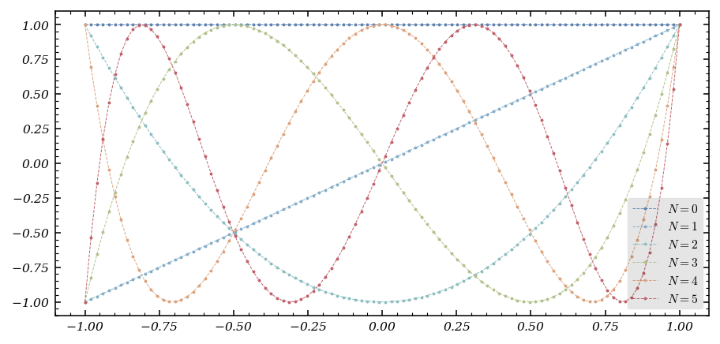
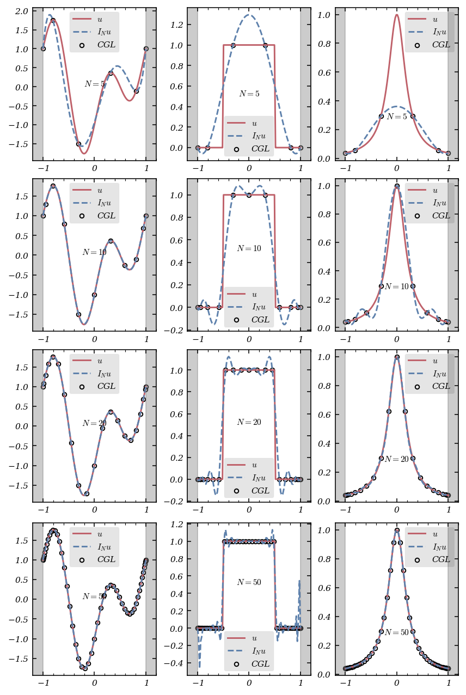
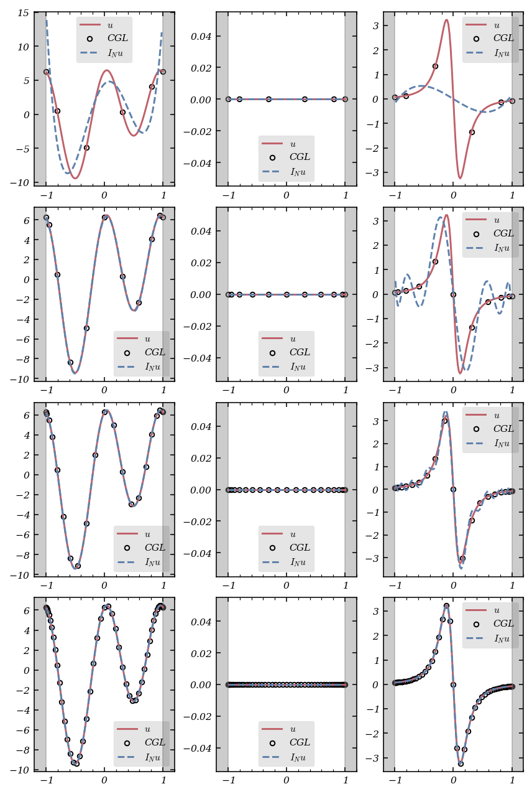
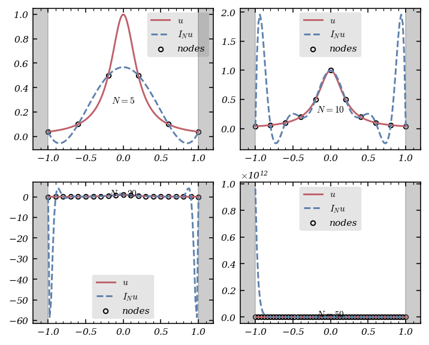
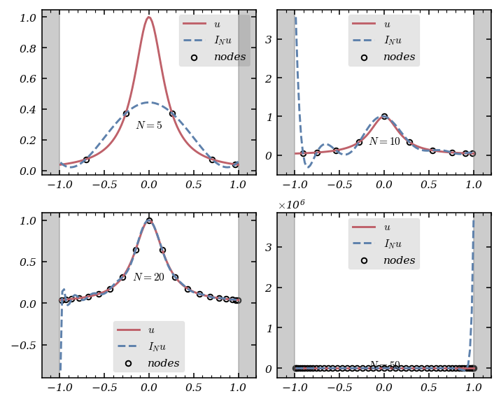

# Tutorial. The Chebyshev interpolation

Spectral methods are the Formula 1 cars of numerical analysis: fast, precise, and, when handled with care, capable of tackling the most challenging computational tracks. In these methods, the solution $u$ is expanded in terms of *trial functions*:


$$
u(x)\approx\sum_{k=0}^{N-1}\tilde{u}_k\phi_k(x),
$$


where the $\tilde{u}_k$ are the expansion coefficients, and the $\phi_k$ are chosen for their mathematical and computational prowess.

But what makes a good trial function? The answer is a blend of convergence, computational efficiency, and ease of differentiation. For non-periodic boundary problems, algebraic polynomials—especially those orthogonal with respect to a weighted $L^2$ scalar product—are the tools of choice. Enter the Chebyshev polynomials.

---

## Chebyshev Polynomials: The Orthogonal Superstars

The Chebyshev polynomials of the first kind, $T_k(x)$, are orthogonal on $(-1,1)$ with respect to the weight $w(x)=\frac{1}{\sqrt{1-x^2}}. They satisfy:

$$
T_k(\cos(\theta)) = \cos(k\theta)
$$

and can be generated by the recurrence:


$$
\begin{align*}
&T_0(x) = 1,\\
&T_1(x) = x,\\
&\forall k\in\mathbb{N}^*,\ T_{k+1}(x) = 2xT_{k}(x)-T_{k-1}(x).
\end{align*}
$$


The Chebyshev-Gauss-Lobatto (CGL) nodes, $x_j = \cos\left(\frac{\pi j}{N}\right)$, are the extrema of $T_N$ and are the secret to taming the wild oscillations of high-degree polynomial interpolation.

Let’s compute the coefficients of the first $N+1$ Chebyshev polynomials in the canonical basis:

```python
def compute_Chebyshev_coefficients(N : int) -> Callable :
    """
    compute_Chebyshev_coefficients compute the the coefficients in the canonical basis of
    P_N of the N + 1 first Chebyshev polynomial

    Parameters
    ----------
    N : int
        _description_

    Returns
    -------
    Callable
        array of coefficients
    """
    array_coeff = np.zeros(shape = (N+1, N + 1))

    array_coeff[0][0] = 1
    array_coeff[1][1] = 1

    for k in range(2, N + 1) :

        array_coeff[k] = 2 * np.insert(array_coeff[k-1,:-1],0,0) - array_coeff[k-2]

    return array_coeff
```

And visualize them:

```python
from numpy.polynomial.polynomial import polyval

fig, ax = plt.subplots()
color = color_list(6)
x = np.linspace(-1,1, 100)

for N in range(6):
    ax.plot(x, polyval(x,coeffs[N]), '-o', lw = .5, markersize = 1, linestyle = 'dashed', color = color[N], label = f'$N = {N}$')

ax.legend()
```



---

## Chebyshev Interpolation: Lagrange Meets Chebyshev

Given a function $u$ on $[-1,1]$, we interpolate it at the CGL points, writing the interpolant in the Chebyshev basis:

$$
I_Nu(x)=\sum_{k=0}^N\tilde{u}_kT_k(x).
$$

But how do we compute the coefficients $\tilde{u}_k$? The answer is a beautiful connection to the [discrete cosine transform](https://en.wikipedia.org/wiki/Discrete_cosine_transform):

$$
\tilde u_k = \frac{2}{N \bar c_k} \sum_{j=0}^{N} u(x_j) \frac{1}{\bar c_j} \cos\left(\frac{k \pi}{N} j\right)
$$

where $\bar c_j = 2$ if $j=0$ or $N$, and $1$ otherwise.

With `scipy.fft.dct`, this becomes:

```python
from scipy import fft
def compute_dct_coeff(N : int, u : Callable) :
    """
    compute_Chebyshev_coeff _summary_

    Parameters
    ----------
    N : int
        _description_
    u : Callable
        _description_
    """
    x = np.cos(np.arange(N+1)/N * np.pi)
    u_ = u(x)
    coeffs = fft.dct(u_,  type = 1, norm = 'forward')
    coeffs[1:-1] = 2 * coeffs[1:-1]

    return coeffs
```

To evaluate the interpolant at arbitrary points:

```python
def interpolant_chebyshev(set_coefficients : Iterable, set_points : Iterable) :
    """
    interpolant_chebyshev _summary_

    Parameters
    ----------
    set_coefficients : _type_
        _description_
    """
    coeffs_chebyshev = compute_Chebyshev_coefficients(len(set_coefficients))
    poly = 0

    for k in range(len(set_coefficients)) :

        poly +=  polyval(set_points, coeffs_chebyshev[k]) * set_coefficients[k]

    return poly
```

Let’s see Chebyshev interpolation in action for three functions:

* $u(x) = \cos((x + 1)\pi) + \sin(2(x + 1)\pi)$,
* $u(x) = \mathbb{1}_{\left[-\frac{1}{2},\frac{1}{2}\right]}(x)$,
* $u(x) = \dfrac{1}{1+25x^2}$.

```python
fig, ax = plt.subplots(4,3, figsize = (6,9))
x = np.linspace(-1,1,100)
N = [5, 10, 20, 50]
func = [u_1, u_2, u_3]
color = color_list(2)

for k in range(len(N)):
    for j in range(3) :
        ax[k,j].plot(x,func[j](x), color = color[1], label = '$u$')
        ax[k,j].plot(x, interpolant_chebyshev(compute_dct_coeff(N[k], func[j]), x),'--', color = color[0], label = '$I_N u $')
        CGL = np.cos(np.arange(N[k] + 1)/N[k] * np.pi)
        ax[k,j].scatter(CGL, func[j](CGL), s = 15, fc = (0,0,0,0), ec = 'k',  label = 'CGL')
        ax[k,j].set_xlim(-1.2, 1.2)
        ax[k,j].axvspan(-1.2,-1, color = 'grey', alpha = .4)
        ax[k,j].axvspan(1,1.2, color = 'grey', alpha = .4)
        ax[k,j].text(0, np.mean(func[j](x)), f"$N = {N[k]}$", ha = 'center')
        ax[k,j].legend()
```



Chebyshev interpolation is spectacular for smooth functions, but for discontinuous ones, the [Gibbs phenomenon](https://en.wikipedia.org/wiki/Gibbs_phenomenon) appears—those pesky oscillations near the jump.

---

## Differentiation in the Chebyshev World

The Chebyshev interpolation derivative is the derivative of the interpolant:

$$
\mathcal{D}_Nu=(I_Nu)' = \sum_{k=0}^N\tilde{u}_k{T_k}'(x).
$$

A remarkable formula gives the derivative at $x$:


$$
(I_Nu)'(x) = \frac{1}{\sqrt{1-x^2}}\sum_{k=0}^Nk\tilde{u}_k\sin(k\arccos(x)),
$$


and at the endpoints:


$$
(I_Nu)'(1)=\sum_{k=0}^Nk^2\tilde{u}_k,\\
(I_Nu)'(-1)=\sum_{k=0}^N(-1)^{k+1}k^2\tilde{u}_k.
$$


To compute the derivative at the nodes:

```python
def der_interpolant(coeff_interpolant, nodes) :
    """
    interpolant_chebyshev _summary_

    Parameters
    ----------
    set_coefficients : _type_
        _description_
    """
    coef = 1/np.sqrt(1 - nodes**2)
    k = np.arange(len(coeff_interpolant))
    interpol = np.empty_like(nodes)

    for j in range(len(nodes)) :

        interpol[j] = np.sum(k * coeff_interpolant * np.sin(k *  np.arccos(nodes[j])))

    return coef * interpol
```

Let’s compare the true derivatives and their Chebyshev interpolants for several $N$:

```python
fig, ax = plt.subplots(4,3, figsize = (6,9))
x = np.linspace(-.99,1,100)
N = [5, 10, 20, 50]
func = [u_1, u_2, u_3]
funcp =[u_1p, u_2p, u_3p]
color = color_list(2)

for k in range(len(N)):
    for j in range(3) :
        ax[k,j].plot(x,funcp[j](x), color = color[1], label = '$u$')
        CGL = np.cos(np.arange(N[k] + 1)/N[k] * np.pi)
        ax[k,j].scatter(CGL, funcp[j](CGL), s = 15, fc = (0,0,0,0), ec = 'k',  label = 'CGL')
        ax[k,j].plot(x, der_interpolant(compute_dct_coeff(N[k], func[j]), x),'--', color = color[0], label = '$I_N u $')
        ax[k,j].set_xlim(-1.2, 1.2)
        ax[k,j].axvspan(-1.2,-1, color = 'grey', alpha = .4)
        ax[k,j].axvspan(1,1.2, color = 'grey', alpha = .4)
        ax[k,j].legend()
```



---

## The Runge Phenomenon: When Equidistant Nodes Go Rogue

Interpolating at equidistant nodes can be disastrous for certain functions, like $u(x)=\frac{1}{1 + 25x^2}$. As $N$ increases, the interpolant oscillates wildly near the endpoints—a phenomenon known as the [Runge phenomenon](https://en.wikipedia.org/wiki/Runge%27s_phenomenon).

Let’s see this in action:

```python
from scipy.interpolate import lagrange

fig, axes = plt.subplots(2,2, figsize = (5,4))
x = np.linspace(-1,1,100)
N = [5, 10, 20, 50]
color = color_list(2)

for k, ax in enumerate(axes.flat) :
    points = -1 + 2 * np.arange(N[k] + 1)/N[k]
    ax.plot(x,u_3(x), color = color[1], label = '$u$')
    ax.plot(x, lagrange(points, u_3(points))(x),'--', color = color[0], label = '$I_N u $')
    ax.scatter(points, u_3(points), s = 15, fc = (0,0,0,0), ec = 'k',  label = 'nodes')
    ax.set_xlim(-1.2, 1.2)
    ax.axvspan(-1.2,-1, color = 'grey', alpha = .4)
    ax.axvspan(1,1.2, color = 'grey', alpha = .4)
    ax.text(0, np.mean(u_3(x)), f"$N = {N[k]}$", ha = 'center')
    ax.legend()
```



As $N$ increases, the interpolant diverges near the endpoints—clearly, equidistant nodes are not the way to go for high-degree polynomial interpolation.

---

## Chebyshev Nodes to the Rescue

Now, let’s interpolate at Chebyshev nodes:

```python
fig, axes = plt.subplots(2,2, figsize = (5,4))
x = np.linspace(-.99,1,100)
N = [5, 10, 20, 50]
color = color_list(2)

for k, ax in enumerate(axes.flat) :
    points = np.cos((2 * np.arange(N[k]) +1) / (2 * (N[k] + 1)) * np.pi)
    ax.plot(x,u_3(x), color = color[1], label = '$u$')
    ax.plot(x, lagrange(points, u_3(points))(x),'--', color = color[0], label = '$I_N u $')
    ax.scatter(points, u_3(points), s = 15, fc = (0,0,0,0), ec = 'k',  label = 'nodes')
    ax.set_xlim(-1.2, 1.2)
    ax.axvspan(-1.2,-1, color = 'grey', alpha = .4)
    ax.axvspan(1,1.2, color = 'grey', alpha = .4)
    ax.text(0, np.mean(u_3(x)), f"$N = {N[k]}$", ha = 'center')
    ax.legend()
```



With Chebyshev nodes, the interpolation remains stable and accurate even for large $N$. The lesson is clear: for polynomial interpolation, Chebyshev nodes are the gold standard.

---

## Conclusion

Chebyshev interpolation combines mathematical elegance with computational efficiency. By choosing the right nodes and leveraging the power of the discrete cosine transform, we can achieve high-accuracy approximations and derivatives, while avoiding the pitfalls of the Runge phenomenon. For smooth functions, Chebyshev interpolation is a near-perfect tool; for discontinuous ones, beware the Gibbs phenomenon—but even then, it’s often the best you can do. Happy interpolating!
