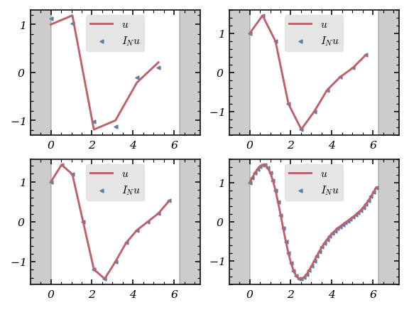

# Tutorial. Numerical solution of a partial differential equation using a collocation spectral method

Welcome to the world of collocation spectral methods, where we solve partial differential equations (PDEs) with the speed and elegance of spectral expansions. In this notebook, we’ll tackle an initial-value problem for a linear PDE using two algorithmic approaches: one powered by the fast Fourier transform (FFT), the other by the brute force of differentiation matrices.

We’ll need a few trusty libraries, including `fft` from <tt>scipy</tt> for efficient Chebyshev transforms:

```python
import numpy as np
import scipy as scp
from scipy import fft

# To draw matplotlib plots within this notebook.
%matplotlib inline
import matplotlib
import matplotlib.pyplot as plt
from python_code.nord_cmap import *
from typing import Iterable, Callable
```

---

## Differentiation in Collocation Spectral Methods: FFT vs. Matrix Multiplication

When implementing a collocation spectral method, differentiation at the collocation points can be performed in two ways: via FFTs or by multiplying with a differentiation matrix.

Let’s start with the Fourier interpolation derivative matrix $D_N$. For an even $N$, the approximate value of the first derivative of a function $u$ at the collocation point $x_j=\frac{2\pi j}{N}$ is given by

$$
\sum_{l=0}^{N-1}\left(D_N^{(1)}\right)_{jl}u(x_l),
$$

where

$$
\left(D_N^{(1)}\right)_{jl}=\begin{cases}\frac{1}{2}(-1)^{j+l}\cot\left(\frac{(j-l)\pi}{N}\right)&\text{if }j\neq l,\\0&\text{if }j=l.\end{cases}
$$

This matrix is a [Toeplitz matrix](https://en.wikipedia.org/wiki/Toeplitz_matrix), which means it’s constant along its diagonals—a property that makes it efficient to store and manipulate.

Let’s see how this works in practice for $u(x)=\exp(\sin(x))$:

```python
from time import time
from fourrier import *

def compute_FIDM(N) :
    j = np.arange(1,N)
    first_column = np.insert(1/2 * (-1) ** j * 1/np.tan(j * np.pi / N),0,0)
    first_row = - first_column
    FIDM = scp.linalg.toeplitz(first_column, first_row)
    return FIDM

def u(x) : return np.exp(np.sin(x))
def u_p(x) : return np.cos(x) * np.exp(np.sin(x))
```

Let’s compare the accuracy and execution time of matrix-based differentiation and FFT-based differentiation for various $N$:

```python
fig, axes = plt.subplots(2,2, figsize = (4,3))
color = color_list(2)
N = [6, 10, 12, 50, 80, 100, *[2 ** k for k in range(3, 12)]]

time_mat = []
time_fft = []

error_mat = []
error_fft = []

for k in range(len(N)) :
    collocation = np.arange(N[k]) * 2 * np.pi / N[k]
    t0 = time()
    interp1 = compute_FIDM(N[k]) @ u(collocation)
    time_mat.append(time()- t0)

    t0 = time()
    x = np.linspace(-.99,.99, 100)
    interp2 = der_interpolant(compute_dct_coeff(N[k],u), x)
    time_fft.append(time()- t0)

    error_mat.append(np.max(np.abs(u_p(collocation) - interp1)))
    error_fft.append(np.max(np.abs(u_p(x) - interp2)))

for k,ax in enumerate(axes.flat) :
    collocation = np.arange(N[k]) * 2 * np.pi / N[k]
    interp1 = compute_FIDM(N[k]) @ u(collocation)
    ax.plot(collocation,u_p(collocation), color = color[1], label = '$u$')
    ax.scatter(collocation, interp1,s = 5, marker = '<',color = color[0], label = '$I_N u $')
    ax.set_xlim(-1, 2 * np.pi + 1)
    ax.axvspan(2 * np.pi, 2 * np.pi + 1, color = 'grey', alpha = .4)
    ax.axvspan(-1,0, color = 'grey', alpha = .4)
    ax.legend()
```



And now, let’s visualize the time and error scaling:

```python
fig, ax = plt.subplots(1,2, figsize = (5,2))

ax[0].scatter(N, time_mat, color = color[0], s = 5, marker = '>', label = 'Matrix')
ax[0].scatter(N, time_fft, color = color[1], s = 5, marker = 'o', label = 'FFT')
ax[0].set_xlabel('N')
ax[0].set_ylabel('time-[s]')
ax[0].set_xscale('log')
ax[0].set_yscale('log')
ax[0].legend()
ax[0].grid(which = 'both', alpha = .4)

ax[1].scatter(N, error_mat, color = color[0], s = 5, marker = '>', label = 'Matrix')
ax[1].scatter(N, error_fft, color = color[1], s = 5, marker = 'o', label = 'FFT')
ax[1].set_xlabel('N')
ax[1].set_ylabel('numerical error')
ax[1].set_xscale('log')
ax[1].set_yscale('log')
ax[1].grid(which = 'both', alpha = .4)
ax[1].legend()
```


The results are clear: FFT-based differentiation is much faster for large $N$, while both methods are highly accurate for smooth periodic functions.

---

For non-periodic functions, Chebyshev interpolation differentiation can also be achieved using a matrix. The Chebyshev differentiation matrix $D_N$ can be written in closed form:

$$
\left(D_N^{(1)}\right)_{jl}=\begin{cases}\dfrac{2N^2+1}{6}&j=l=0,\\-\dfrac{x_j}{2(1-{x_j}^2)}&1\leq j,l\leq N-1,\ j=l\\\dfrac{c_j}{c_l}\dfrac{(-1)^{j+l}}{x_j-x_l}&1\leq j,l\leq N-1,\ j\neq l,\\-\dfrac{2N^2+1}{6}&j=l=N,\end{cases}
$$

where $c_j=2$ if $j=0$ or $N$, and $1$ otherwise, and $x_j=\cos\left(\frac{\pi j}{N}\right)$.

Let’s implement and test this for $u(x)=\exp(-x^2)$:

```python
def compute_FIDM_np(N) :
    x = np.cos(np.pi * np.arange(N + 1) / N )
    c = np.insert(np.ones(N-1),[0,N-1], [2,2])
    D_N = np.empty(shape = (N+1, N+1))
    for j in range(N + 1) :
        for l in range(N + 1) :
            if j == 0 and l == 0 :
                D_N[j,l] = (2 * N ** 2 + 1) / 6
            if j == N and l == N :
                D_N[j,l] = - (2 * N ** 2 + 1) / 6
            if j == l and j < N and j > 0 :
                D_N[j,l] = - x[j] / (2 * (1 - x[j] ** 2))
            if j != l :
                D_N[j,l] =  c[j]/c[l] * ((-1) ** (j + l)) / (x[j] - x[l])
    return D_N

def u(x) : return np.exp(- x ** 2)
def u_p(x) : return - 2 * x * np.exp(- x ** 2)
```

And compare matrix and FFT-based differentiation:

```python
fig, axes = plt.subplots(2,2, figsize = (4,3))
color = color_list(2)
N = [6, 10, 12, 50, 80, 100, *[2 ** k for k in range(3, 12)]]

time_mat = []
time_fft = []

error_mat = []
error_fft = []

for k in range(len(N)) :
    collocation = np.cos(np.pi * np.arange(N[k] + 1) / N[k] )
    t0 = time()
    interp1 =compute_FIDM_np(N[k]) @ u(collocation)
    time_mat.append(time()- t0)

    t0 = time()
    x = np.linspace(-.99,.99, 100)
    interp2 = der_interpolant(compute_dct_coeff(N[k],u), x)
    time_fft.append(time()- t0)

    error_mat.append(np.max(np.abs(u_p(collocation) - interp1)))
    error_fft.append(np.max(np.abs(u_p(x) - interp2)))

for k,ax in enumerate(axes.flat) :
    collocation = np.cos(np.pi * np.arange(N[k] + 1) / N[k] )
    ax.plot(collocation,u_p(collocation), color = color[1], label = '$u$')
    ax.scatter(collocation, compute_FIDM_np(N[k]) @ u(collocation), s= 5, marker = '>', color = color[0], label = '$I_N u $')
    ax.set_xlim(-1.2, 1.2)
    ax.axvspan(-1.2, -1, color = 'grey', alpha = .4)
    ax.axvspan(1,1.2, color = 'grey', alpha = .4)
    ax.legend()
```


```python
fig, ax = plt.subplots(1,2, figsize = (5,2))

ax[0].scatter(N, time_mat, color = color[0], s = 5, marker = '>', label = 'Matrix')
ax[0].scatter(N, time_fft, color = color[1], s = 5, marker = 'o', label = 'FFT')
ax[0].set_xlabel('N')
ax[0].set_ylabel('time-[s]')
ax[0].set_xscale('log')
ax[0].set_yscale('log')
ax[0].legend()
ax[0].grid(which = 'both', alpha = .4)

ax[1].scatter(N, error_mat, color = color[0], s = 5, marker = '>', label = 'Matrix')
ax[1].scatter(N, error_fft, color = color[1], s = 5, marker = 'o', label = 'FFT')
ax[1].set_xlabel('N')
ax[1].set_ylabel('numerical error')
ax[1].set_xscale('log')
ax[1].set_yscale('log')
ax[1].grid(which = 'both', alpha = .4)
ax[1].legend()
```


Again, FFT-based differentiation is much faster for large $N$, but both methods are accurate for smooth functions.

---

## Solving the 2D Wave Equation with a Chebyshev Collocation Spectral Method

Let’s turn up the challenge: we’ll solve the 2D wave equation

$$
\frac{\partial^2u}{\partial t^2}(t,x,y)-\left(\frac{\partial^2u}{\partial x^2}(t,x,y)+\frac{\partial^2u}{\partial y^2}(t,x,y)\right)=0,\ (x,y)\in(-1,1)^2,\ t\in(0,+\infty),
$$

with homogeneous Dirichlet boundary conditions and initial data

$$
u(0,x,y)=e^{-40((x-0.4)^2+y^2)},\quad \frac{\partial u}{\partial t}(0,x,y)=0.
$$

We’ll use a Chebyshev collocation spectral method in space and a leap-frog scheme in time (the [method of lines](https://en.wikipedia.org/wiki/Method_of_lines)). The time step $\Delta t$ must satisfy a CFL-like condition: $\Delta t\leq C N^{-2}$, with $C\leq 6.5$.

To compute the second-order Chebyshev interpolation derivative efficiently, we use the discrete Chebyshev coefficients and FFT-based algorithms for $O(N\log_2 N)$ complexity.

To visualize the solution, we’ll animate the result:

```python
# for animations
matplotlib.rcParams['animation.embed_limit']=2**128
from matplotlib import cm
from mpl_toolkits.mplot3d import Axes3D

from matplotlib import animation
from IPython.display import HTML

# plot the result as an animation
fig,ax=plt.subplots(subplot_kw={"projection": "3d"})
ax.set_xlim((-1.,1))
ax.set_xlabel(r'$x$')
ax.set_ylim((-1.,1.))
ax.set_ylabel(r'$y$')
ax.set_zlim((-1.,1.))
ax.set_zlabel(r'$u(t,x,y)$')

def animate(i,zarray,frame):
    frame[0].remove()
    frame[0]=ax.plot_surface(xx,yy,zarray[i,:,:],rstride=1,cstride=1,cmap=cm.autumn,edgecolor='black')
    ax.set_title(r't='+f'{i*dt:.1f}')

frame=[ax.plot_surface(xx,yy,V[0,:,:],rstride=1,cstride=1,cmap=cm.autumn,edgecolor='black')]

anim=animation.FuncAnimation(fig,animate,nplots,fargs=(V,frame),interval=10)
HTML(anim.to_jshtml())
```

---

Second-order Chebyshev interpolation differentiation can also be achieved using a matrix, which can be obtained as the square of the first-order Chebyshev differentiation matrix (at $O(N^3)$ cost), or directly via the closed-form:

$$
\left(D_N^{(2)}\right)_{jl}=\begin{cases}\dfrac{(-1)^{j+l}}{c_l}\dfrac{{x_j}^2+x_jx_l-2}{(1-{x_j}^2)(x_j-x_l)^2},&1\leq j\leq N-1,\ 0\leq l\leq N,\ j\neq l,\\-\dfrac{(N^2-1)(1-{x_j}^2)+3}{3(1-{x_j}^2)^2},&1\leq j,l\leq N-1,\ j=l,\\\dfrac{2}{3}\dfrac{(-1)^l}{c_l}\dfrac{(2N^2+1)(1-x_l)-6}{(1-x_l)^2},&j=0,\ 1\leq l\leq N,\\\dfrac{2}{3}\dfrac{(-1)^{l+N}}{c_l}\dfrac{(2N^2+1)(1+x_l)-6}{(1+x_l)^2},&j=N,\ 0\leq l\leq N-1\\\dfrac{N^4-1}{15},&j=l=0\text{ or }N,\end{cases}
$$

where $c_j=2$ if $j=0$ or $N$, and $1$ otherwise.

For large-scale problems, FFT-based approaches are preferred for their speed, but matrix-based methods remain valuable for their clarity and directness.

---

## Conclusion

Collocation spectral methods offer a powerful, flexible framework for solving PDEs. Whether you choose the speed of FFTs or the transparency of matrix multiplication, you’ll find these tools indispensable for high-accuracy numerical solutions. And with the right visualization, you can watch your solutions come to life—literally!
